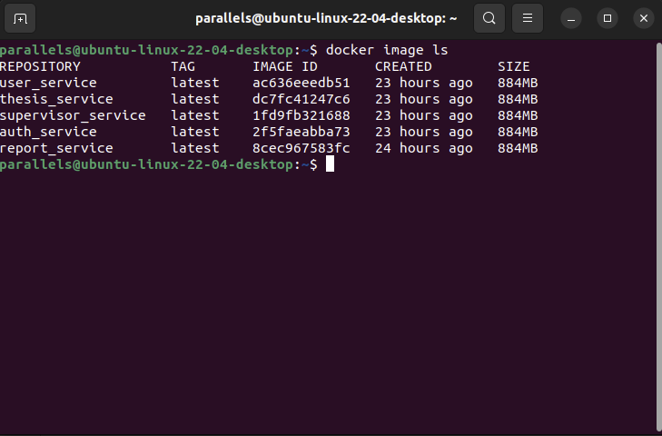
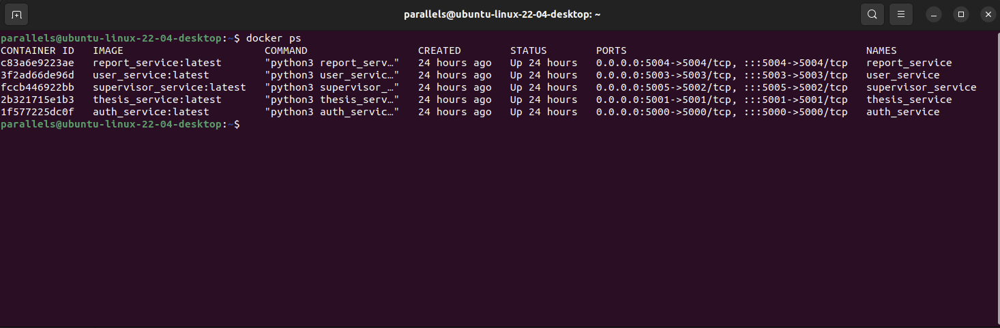

# Bachelor Thesis - Microservices Projekt

Aufgabestellung Übersicht: 


## Einrichtung 

1. Projekt clonen 

    ``` 
    git clone https://github.com/user066274/project_microservices.git 
    ```

2. Docker images erstellen 

    ```
        docker build -t auth_service:latest ./auth_service
        docker build -t thesis_service:latest ./thesis_service
        docker build -t supervisor_service:latest ./supervisor_service
        docker build -t user_service:latest ./user_service
        docker build -t report_service:latest ./report_service
    ```

    **Überprüfen, ob alle Docker Images erstellt wurden** 

    ```
        docker image ls 
    ```

    Der Output sollte folgendermaßen aussehen: 

    

4. Docker Container starten 
    
    Bevor die Dockercontainer gestartet werden sollte überprüft werden, ob die **Ports 5000 - 5004** bereits in Verwendung sind. 

    Danach können die Docker Container gestartet werden: 

    ```
        docker run -d -p 5000:5000 --name auth_service auth_service:latest
        docker run -d -p 5001:5001 --name thesis_service thesis_service:latest
        docker run -d -p 5002:5002 --name supervisor_service supervisor_service:latest
        docker run -d -p 5003:5003 --name user_service user_service:latest
        docker run -d -p 5004:5004 --name report_service report_service:latest
    ```

    Nach erfolgreichem Ausführen der Container können alle laufenden Container mit folgenden Command angezeigt werden 

    ```
        docker ps 
    ```

    Das Ergebnis sollte wie folgt aussehen: 

    

## Testen der Services

Zum Testen der Services kann "curl" im Terminal benutzt werden. Eine Alternative mit User Interface ist das Programm [Postman](https://www.postman.com/)

1. **User Service** 

    Neuen Benutzer mit Rolle registrieren 
    ```
        curl -X POST -H "Content-Type: application/json" -d '{"username": "user1", "email": "user1@example.com", "role": "student"}' http://localhost:5003/users
    ```

    Benutzerinformationen abrufen (UserID = 1) 

    ```
        curl -X GET -H "Content-Type: application/json" http://localhost:5003/users/1
    ```

    Benutzerinformationen aktualisieren (UserID = 1)

    ```
        curl -X PUT -H "Content-Type: application/json" -d '{"email": "newuser1@example.com", "role": "validator"}' http://localhost:5003/users/1
    ```

2. **Auth Service**

    Einen User registrieren 

    ```
        curl -X POST -H "Content-Type: application/json" -d '{"username": "testuser", "password": "testpassword"}' http://localhost:5000/register
    ```

    User mit Benutzername / Passwort anmelden 

    ```
        curl -X POST -H "Content-Type: application/json" -d '{"username": "testuser", "password": "testpassword"}' http://localhost:5000/login
    ```

    Anmeldung mit JWS Token 

    ```
        curl -X GET -H "Content-Type: application/json" -H "Authorization: Bearer your_jwt_token" http://localhost:5000/protected
    ```


3. **Report Service**

    Neuen Bericht hinzufügen  

    ```
        curl -X POST -H "Content-Type: application/json" -d '{"thesis_id": 1, "supervisor_id": 1, "content": "This is the first report"}' http://localhost:5004/reports
    ```

    Alle Berichten anzeigen  

    ```
        curl -X GET -H "Content-Type: application/json" http://localhost:5004/reports
    ```

    Einen vorhandenen Bericht aktualisieren 

    ```
        curl -X PUT -H "Content-Type: application/json" -d '{"content": "This is the updated report"}' http://localhost:5004/reports/1
    ```

4. **Supervisor Service**

    Neuen Supervisor hinzufügen  

    ```
        curl -X POST -H "Content-Type: application/json" -d '{"name": "John Doe", "department": "Computer Science", "email": "johndoe@example.com"}' http://localhost:5002/supervisors
    ```

    Alle Supervisor anzeigen   

    ```
        curl -X GET -H "Content-Type: application/json" http://localhost:5002/supervisors
    ```

    Einen Supervisor aktualisieren 

    ```
        curl -X PUT -H "Content-Type: application/json" -d '{"name": "Jane Doe", "department": "Computer Science", "email": "janedoe@example.com"}' http://localhost:5002/supervisors/1
    ```

5. **Thesis Service** 

    Neuen Thesis Vorschlag hinzufügen  

    ```
        curl -X POST -H "Content-Type: application/json" -d '{"title": "Sample Thesis Title", "description": "Sample thesis description."}' http://localhost:5001/thesis
    ```

    Alle Thesis Vorschläge anzeigen   

    ```
        curl -X GET -H "Content-Type: application/json" http://localhost:5001/thesis
    ```

    Einen Thesis Vorschlag aktualisieren 

    ```
        curl -X PUT -H "Content-Type: application/json" -d '{"title": "Updated Thesis Title", "description": "Updated thesis description.", "supervisor_id": 2}' http://localhost:5001/thesis/1
    ```


